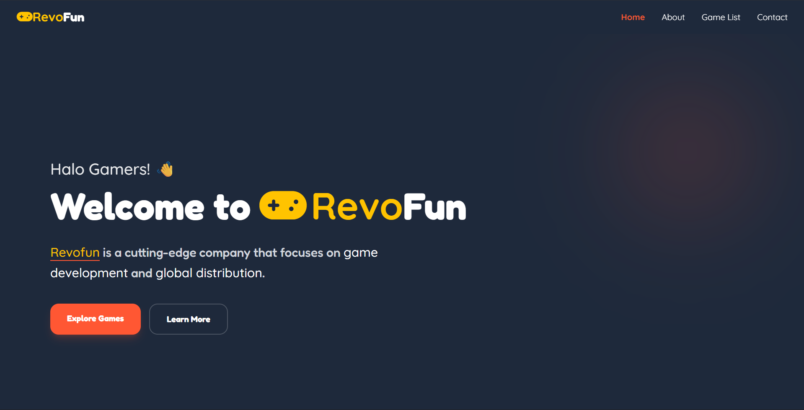

[](https://classroom.github.com/a/1g1UC-tA)

# 👁️ Overview

Revofun is a web application for gaming company. In this website include information about our company, our products,
and our simple game that can be play from our website.

## 📃 Github Pages

### Preview Web: [Click here!]()

---

## 📋 Features

| Feature | Description |
|---------|-------------|
|

---

## 🛠️ Tech Stack

[](https://skillicons.dev)

- HTML: Used for structuring the content of the resume.
- Tailwind CSS: Used for styling the resume and making it visually appealing.
- JavaScript: Used for adding interactivity, such as click navbar.

## 📸 Screenshots

| Image                                                               | Description |
|---------------------------------------------------------------------|-------------|
|  | Homepage    | 

## 📂 Project Structure

```bash
milestone-2-Diba15-1/
|-- assets/  # Assets Folder
|   |-- images/ # Images Folder
|   |-- css/ # CSS Folder
|   |-- javascript/ # JS Folder
|-- pages/ # Pages Folder
|-- index.html
|__ README.md
```