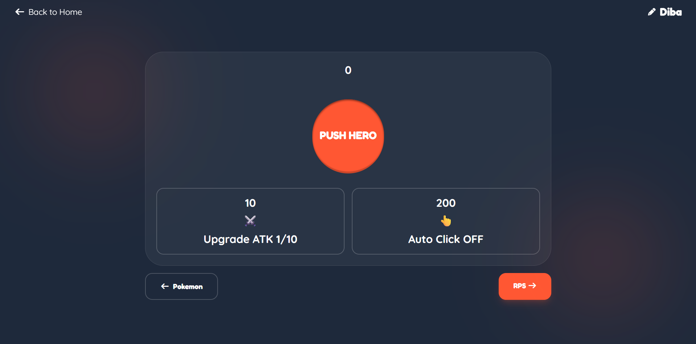
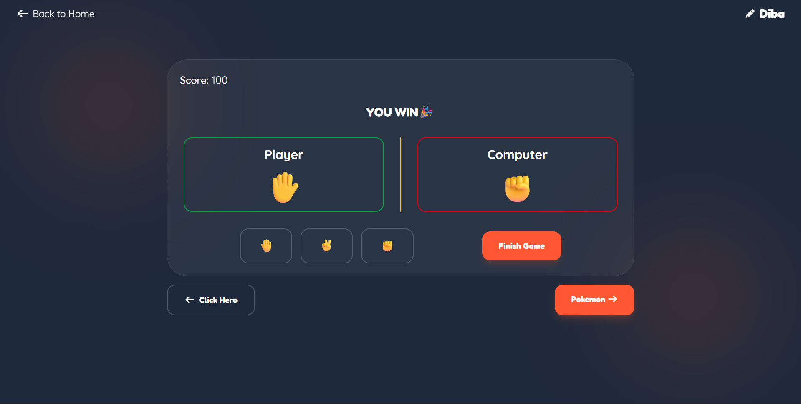
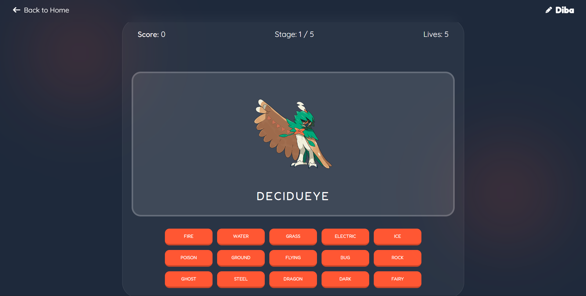

[](https://classroom.github.com/a/1g1UC-tA)

# 👁️ Overview

Revofun is a web application for gaming company. In this website include information about our company, our products,
and our simple game that can be play from our website.

## 📃 Github Pages

### Preview Web: [Click here!](https://revou-fsse-feb26.github.io/milestone-2-Diba15-1/)

---

## 📋 Features

| Feature                | Description                                                           |
|------------------------|-----------------------------------------------------------------------|
| Player Data Management | System that manage player name, score, and leaderboard                |
| Click Hero             | ATK Upgrade system, Auto click system, and milestone achivement.      |
| Rock Paper Scissors    | Shuffle animation.                                                    |
| Pokemon Game           | Integrations reliable Pokemon API, stage progression, and hint system |
| General Features       | Modal system, persistent storage, animations, and error handling      |

---

## 🛠️ Tech Stack

[](https://skillicons.dev)

- HTML: Used for structuring the content of the resume.
- Tailwind CSS: Used for styling the resume and making it visually appealing.
- JavaScript: Used for adding interactivity, such as click navbar.
- PokeAPI: Used for fetching pokemon data.

## 📸 Screenshots

| Image                                                                 | Description         |
|-----------------------------------------------------------------------|---------------------|
|    | Homepage            | 
|  | Click Hero          |
|         | Rock Paper Scissors |
|     | Pokemon Game        |

## 📂 Project Structure

```bash
milestone-2-Diba15-1/
|-- assets/  # Assets Folder
|   |-- images/ # Images Folder
|   |-- css/ # CSS Folder
|   |-- javascript/ # JS Folder
|-- pages/ # Pages Folder
|-- index.html
|__ README.md
```